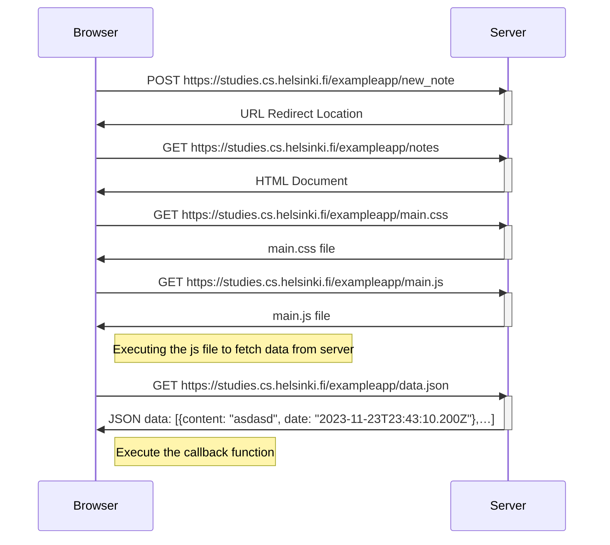

```mermaid
sequenceDiagram
    participant Browser
    participant Server

    Browser->>Server: POST https://studies.cs.helsinki.fi/exampleapp/new_note
    activate Server
    Server->>Browser: URL Redirect Location
    deactivate Server

    Browser->>Server: GET https://studies.cs.helsinki.fi/exampleapp/notes
    activate Server
    Server->>Browser: HTML Document
    deactivate Server

    Browser->>Server: GET https://studies.cs.helsinki.fi/exampleapp/main.css
    activate Server
    Server->>Browser: main.css file
    deactivate Server

    Browser->>Server: GET https://studies.cs.helsinki.fi/exampleapp/main.js
    activate Server
    Server->>Browser: main.js file
    deactivate Server

    Note right of Browser: Executing the js file to fetch data from server

    Browser->>Server: GET https://studies.cs.helsinki.fi/exampleapp/data.json
    activate Server
    Server->>Browser: JSON data: [{content: "asdasd", date: "2023-11-23T23:43:10.200Z"},…]
    deactivate Server
    
    Note right of Browser: Execute the callback function
```

    

  
